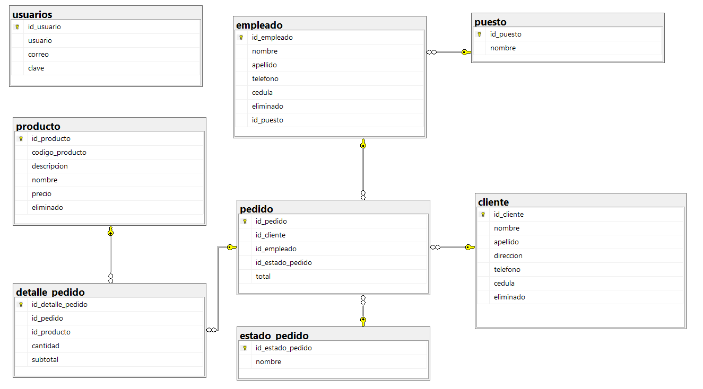
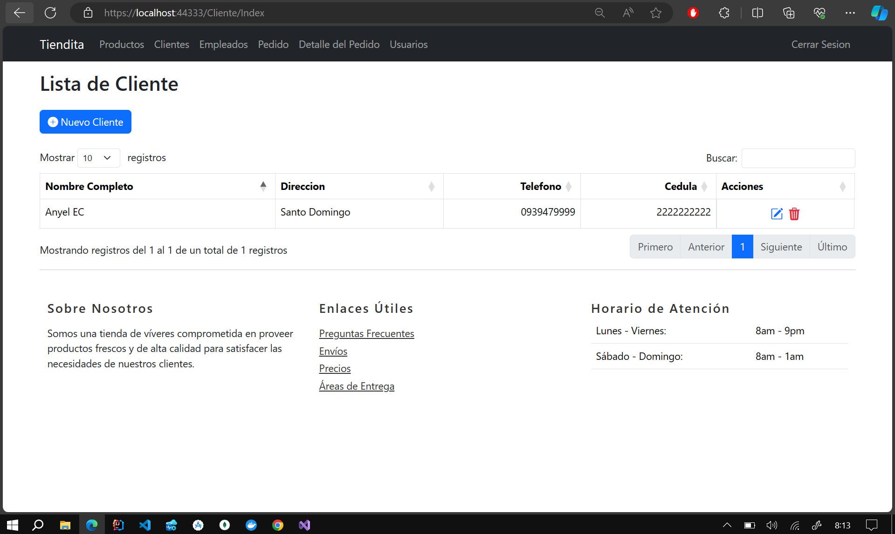
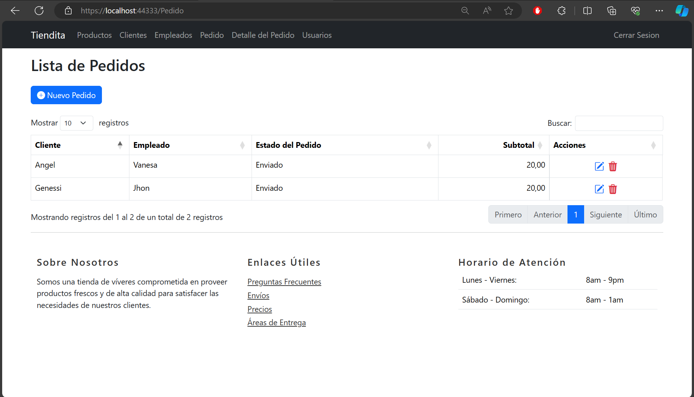
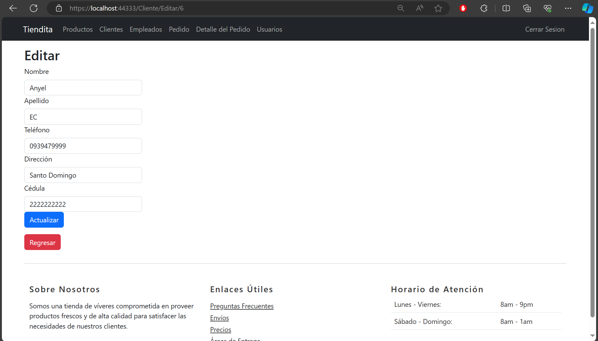

# Proyecto de Tienda

Este es un proyecto de sistema de gestión para una tienda, desarrollado en .NET utilizando la arquitectura MVC (Modelo-Vista-Controlador). El sistema permite realizar operaciones CRUD (Crear, Leer, Actualizar y Eliminar) en diversas entidades relacionadas con el funcionamiento de una tienda, como clientes, empleados, pedidos, productos y detalles de pedidos.
## **Select Language:**
- [Español (Spanish)](README-es.md)
- [English](README.md)

## Result
### ERD en SQL Server
 
### Inicio de Sesión
 
### Cliente
 
### Producto
 
### Orden (Pedido))
 
### Nueva Orden (Pedido)

### Editar Cliente

### Eliminar

## Estructura de la Base de Datos

El sistema utiliza una base de datos relacional con las siguientes tablas:

- `cliente`: Almacena la información de los clientes.
- `estado_pedido`: Guarda los posibles estados de un pedido.
- `puesto`: Define los distintos puestos que pueden ocupar los empleados.
- `empleado`: Contiene la información de los empleados de la tienda.
- `pedido`: Registra los pedidos realizados por los clientes.
- `producto`: Almacena los productos disponibles en la tienda.
- `detalle_pedido`: Guarda los detalles de los productos incluidos en cada pedido.
- `usuario`: Almacena la información de los usuarios del sistema.

## Controladores y Vistas

El proyecto incluye controladores y vistas para realizar operaciones CRUD en las entidades principales del sistema:

- `ClienteController`: Permite gestionar clientes, incluyendo la creación, edición, y eliminación de los mismos.
- `DetallePedidoController`: Gestiona los detalles de los pedidos, como la asociación de productos a pedidos, su edición y eliminación.
- `EmpleadoController`: Permite administrar los empleados de la tienda, incluyendo la asignación de puestos, edición y marcado como eliminado.
- `PedidoController`: Gestiona los pedidos realizados por los clientes, incluyendo su creación, edición y eliminación.
- `ProductoController`: Permite administrar los productos disponibles en la tienda, incluyendo su creación y edición.

## Tecnologías Utilizadas

El proyecto ha sido desarrollado utilizando las siguientes tecnologías y herramientas:

- **Lenguaje de Programación**: C# (ASP.NET).
- **Framework**: .NET Framework.
- **Patrón de Diseño**: Modelo-Vista-Controlador (MVC).
- **Base de Datos**: Microsoft SQL Server.
- **ORM**: Entity Framework.
- **Herramientas Adicionales**: Visual Studio, Entity Framework, LINQ.

## Configuración del Entorno de Desarrollo

Para ejecutar y probar el proyecto en un entorno local, se deben seguir los siguientes pasos:

1. Clonar o descargar el repositorio desde [URL del Repositorio].
2. Abrir el proyecto en Visual Studio.
3. Configurar la cadena de conexión a la base de datos en el archivo `Web.config`.
4. Compilar y ejecutar el proyecto en el entorno de desarrollo local.

## Contribución

Si deseas contribuir al proyecto, puedes realizar las siguientes acciones:

- Realizar un *fork* del repositorio.
- Crear una nueva rama (`git checkout -b feature/nueva-caracteristica`).
- Realizar tus cambios y confirmarlos (`git commit -am 'Agregar nueva característica'`).
- Hacer *push* a la rama (`git push origin feature/nueva-caracteristica`).
- Crear un nuevo *pull request*.

## Autores

- [Anyel EC](www.anyel.top)

## Licencia

Este proyecto está bajo la [Licencia MIT](LICENSE).
