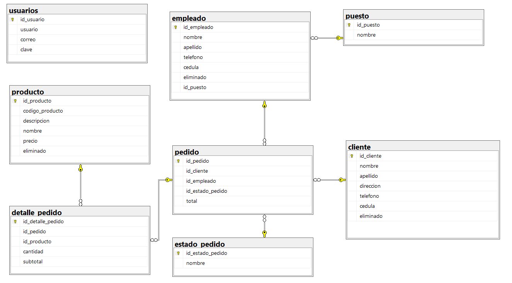
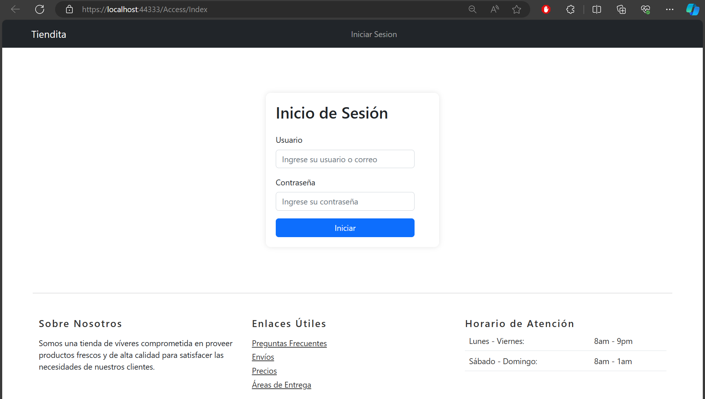
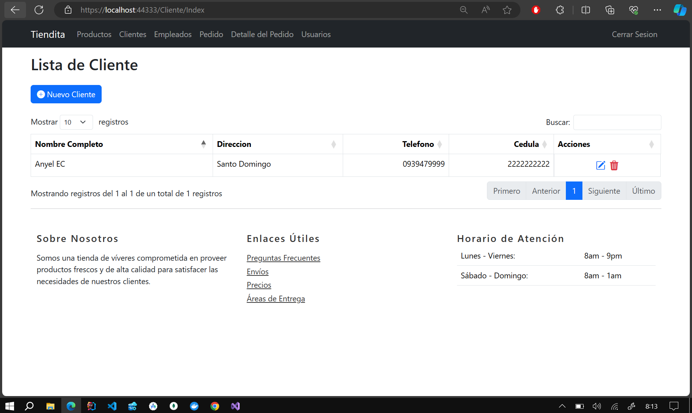
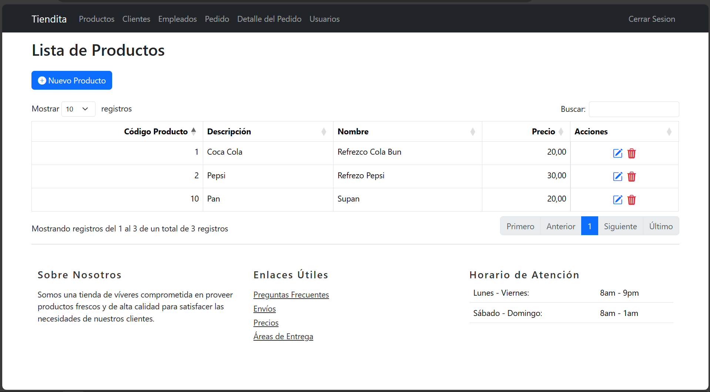
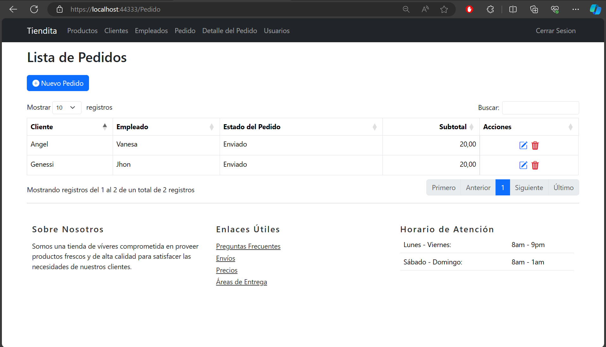
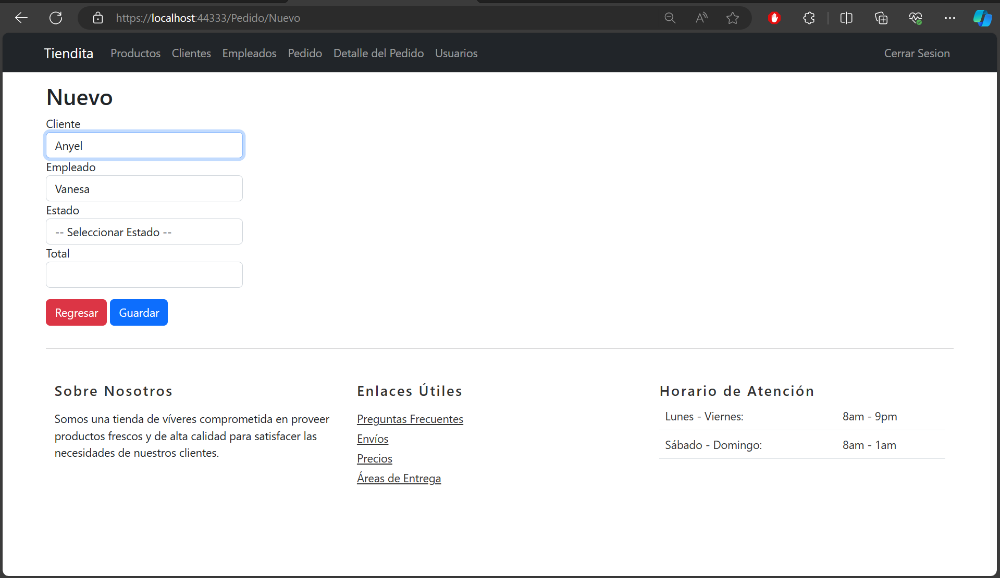
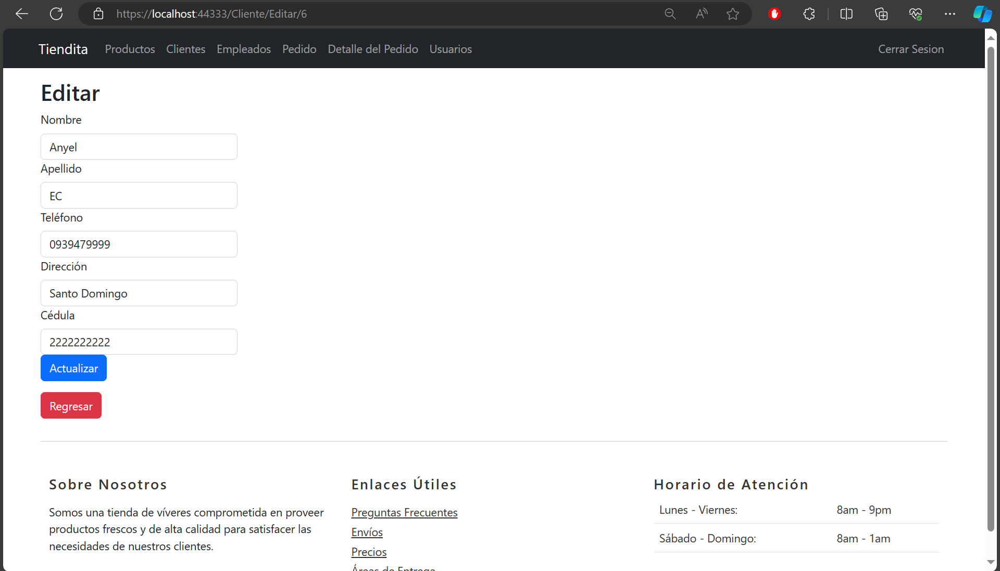
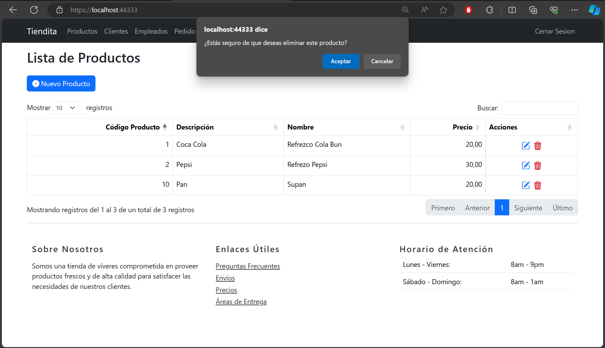

# Store Project in ASP.NET MVC

This is a management system project for a store, developed in .NET using the MVC (Model-View-Controller) architecture. The system allows performing CRUD (Create, Read, Update, Delete) operations on various entities related to the functioning of a store, such as clients, employees, orders, products, and order details.

## **Select Language:**
- [Español (Spanish)](README-es.md)
- [English](README.md)

## Result
### ERD in SQL Server
 
### Log In
 
### Client
 
### Product
 
### Order 
 
### New Order

### Edit Client

### Delete with Alert JS

## Database Structure

The system uses a relational database with the following tables:

- `cliente`: Stores information about clients.
- `estado_pedido`: Saves the possible states of an order.
- `puesto`: Defines the different positions that employees can hold.
- `empleado`: Contains information about the store's employees.
- `pedido`: Records orders placed by clients.
- `producto`: Stores the products available in the store.
- `detalle_pedido`: Saves the details of the products included in each order.
- `usuario`: Stores information about system users.

## Controllers and Views

The project includes controllers and views to perform CRUD operations on the main entities of the system:

- `ClienteController`: Allows managing clients, including creation, editing, and deletion.
- `DetallePedidoController`: Manages order details, such as associating products with orders, editing, and deletion.
- `EmpleadoController`: Allows managing store employees, including position assignment, editing, and marking as deleted.
- `PedidoController`: Manages orders placed by clients, including creation, editing, and deletion.
- `ProductoController`: Allows managing the products available in the store, including creation and editing.

## Technologies Used

The project has been developed using the following technologies and tools:

- **Programming Language**: C# (ASP.NET).
- **Framework**: .NET Framework.
- **Design Pattern**: Model-View-Controller (MVC).
- **Database**: Microsoft SQL Server.
- **ORM**: Entity Framework.
- **Additional Tools**: Visual Studio, Entity Framework, LINQ.

## Development Environment Setup

To run and test the project in a local environment, follow these steps:

1. Clone or download the repository from [Repository URL].
2. Open the project in Visual Studio.
3. Configure the connection string to the database in the `Web.config` file.
4. Build and run the project in the local development environment.

## Contribution

If you wish to contribute to the project, you can take the following actions:

- Fork the repository.
- Create a new branch (`git checkout -b feature/new-feature`).
- Make your changes and commit them (`git commit -am 'Add new feature'`).
- Push the branch (`git push origin feature/new-feature`).
- Create a new pull request.

## Authors

- [Author Name 1]
- [Author Name 2]

## License

This project is licensed under the [MIT License](LICENSE).